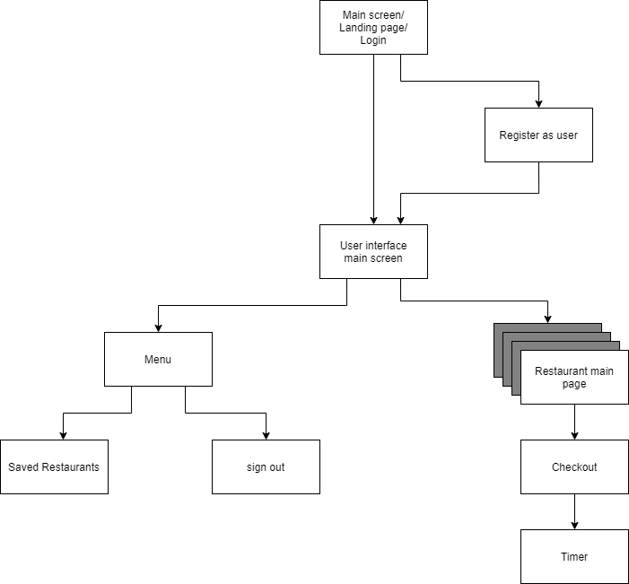
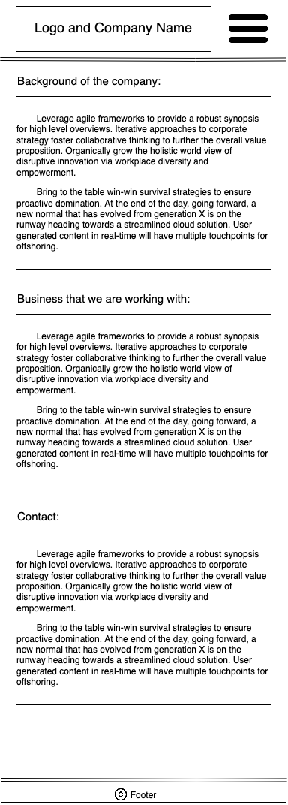
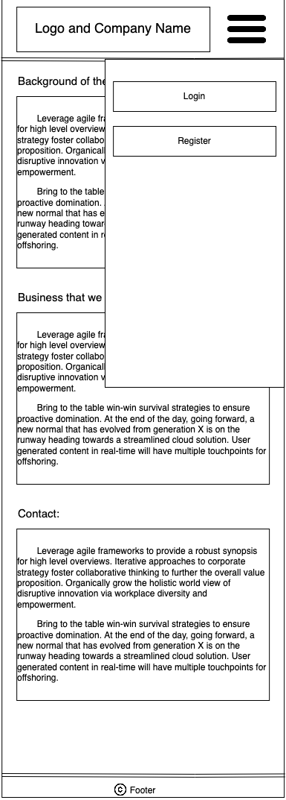

## App Map
  
 
 
 

## Wireframe Diagrams

### Main Page
  
This page is the first place the user lands. It provides the user with backgrounds of the company. In addition, 
the user can log in to their account or register an account by clicking the hamburger icon at the top right. 

### Main Page with Overlay
  
This page presents how the overlay menu on top of the main page looks like. It shows up when the user clicks on the hamburger icon on the main page and provides the user with the options of either logging in or registering. 

### Login 
  
The user is able to log into his/her account by entering their information on this page. When the user finishes inputing the information, he or she could click on the login button to login. 

### Register 
  
The user can register a new account on their page by inputting information and clicking the register button. 

### User Menu
  
The user sees a list of recommended distributors, and has an option to switch to saved distrbutors. The line represents a list with an arbitrary length.

### User Menu (Dynamic)
  
If the user taps on the avatar icon, they will have access to settings along with an option to log out. Everything else remains the same on the page.

### User Settings
  
The user can change their profile, account details, and display preferences if they choose to do so. To exit, they swipe right to return to the original user menu.

## Prototype 
https://saverie.invisionapp.com/console/share/8734W3CTXC
